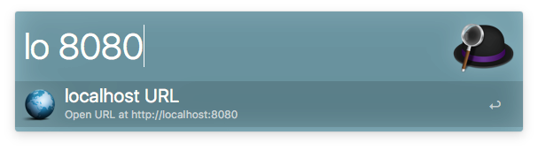

# alfred-localhost

An alfred workflow for quickly opening http://localhost URLs on a specific port. Useful when running local development servers.

## Prerequisites

Requires [Alfred 3.x](http://www.alfredapp.com)

## Installation

Download and double click on the localhost.alfred-workflow file to install.

## Usage

Use the **lo** keyword with an optional port number:

